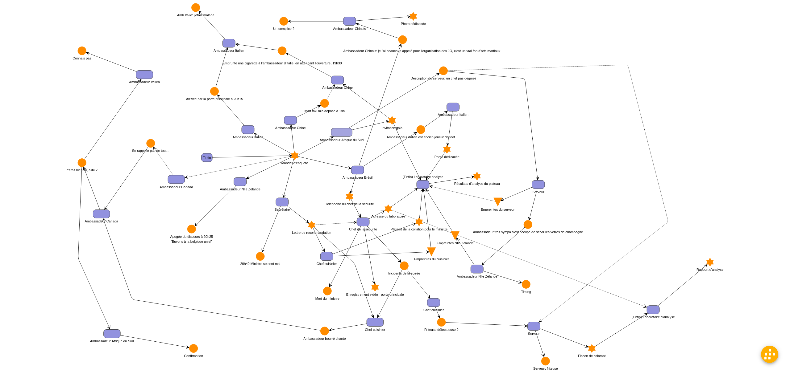

# Graph to cluedo

Le matériel pour le jeu du dimanche 21 après-midi a été généré automatiquement depuis la définition du graphe de l'enquête.

Cela nous a permis de pouvoir itérer sur l'histoire jusqu'au dernier moment, et de laisser l'ordinateur se charger de générer:
- les cartes indices
- les aide-mémoires pour les protagonistes

## Fonctionnement détaillé



1. Édition du graphe d'enquête sur le site de son choix.
   - **Pour choisir sa plateforme, le plus important est de pouvoir exporter le graphe dans un format facile à retravailler!** (a minima un format texte, et idéalement sur une base standard: XML, json...). J'ai choisi [`yEd live`](https://www.yworks.com/yed-live/) qui propose d'exporter le graphe sous le format `graphml` (une forme de XML, assez connue de ce que j'en ai lu).
   - On se fixe des conventions pour écrire nos données. Dans le cas de ce repo: les étoiles représentes des indices, les ronds les déclarations des personnages, les triangles des empreintes. Par ailleurs, on notait dans le champ `URL` de chaque forme le nom de l'image d'illustration, et dans le champ `Description`...la description.
   - Régulièrement, on exporte le résultat sous le format analysable
2. Parsing du fichier exporté pour récupérer les données qui nous intéresse, sous un format plus intéressant. Ici, on transforme le fichier XML (qui contient plein de détails inutiles pour nous) en une liste d'objets `Card` (voir `cluedo.py` pour la définition), et on restocke le résultat en format json (`cluedo.json`)
3. Création des cartes (`image_builder.py`): chaque indice est mis en forme dans une image de la taille d'une carte à jouer, et stockée dans un ficher dédié (dossier `output`)
4. Assemblage en pages des cartes (`a4_builder.py`): les cartes sont assemblées 9 par 9 sur une feuille A4 pour l'impression
5. Création des aide-mémoires pour les personnages (`instructions.py`): chaque "interaction" (si je vois X et Y, alors je peux donner Z et W) est résumée dans un fichier texte

### Détails des fichiers

#### Librairies
- `cluedo.py` définit ce qu'est une carte: un titre, une description, une image... Il y aussi la logique qui extrait les infos utiles d'une `node` graphml
- `size.py` proposes des primitives utiles pour simplifier les calculs de position lors de la construction de la carte
#### Scripts
- `parser.py`: convertit un fichier `graphml` vers un mapping <id_carte>:<carte>, puis stocke le résultat sous `cluedo.json`. C'est ce dernier fichier qui sera utilisé par les scripts suivants
- `image_builder`: construit l'image de chaque carte, à partir du template `template.png`. Le vrai travail est de bien calculer la position des différents éléments


#### Autres
- `images` contient les images d'illustration
- `fonts` les polices de caractère utilisées
- `template.xcf` est le projet Gimp pour générer `template.png`

### Usage

Ce code a été développé et testé sur Ubuntu Linux 20.04.

#### Installation

```sh
# creation d'un virtual env python
python3 -m venv env
# installation des packages requis.
# A priori, on n'utilise que des fonctionnalités de bases des librairies citées
# donc on s'en fiche un peu de la version exacte, mais bon...
pip install -r requirements.txt
```

#### Usage

```sh
python parser.py
python image_builder.py
python a4_builder.py
python instructions.py > instructions.txt
```

## Autres remarques

### Cartes

Le format standard des cartes de collections est:
- hauteur: 3" 5/8 = 92.07499999999999mm
- largeur: 2" 5/8 = 66.675mm
-> on arrondit à 65.02x90mm